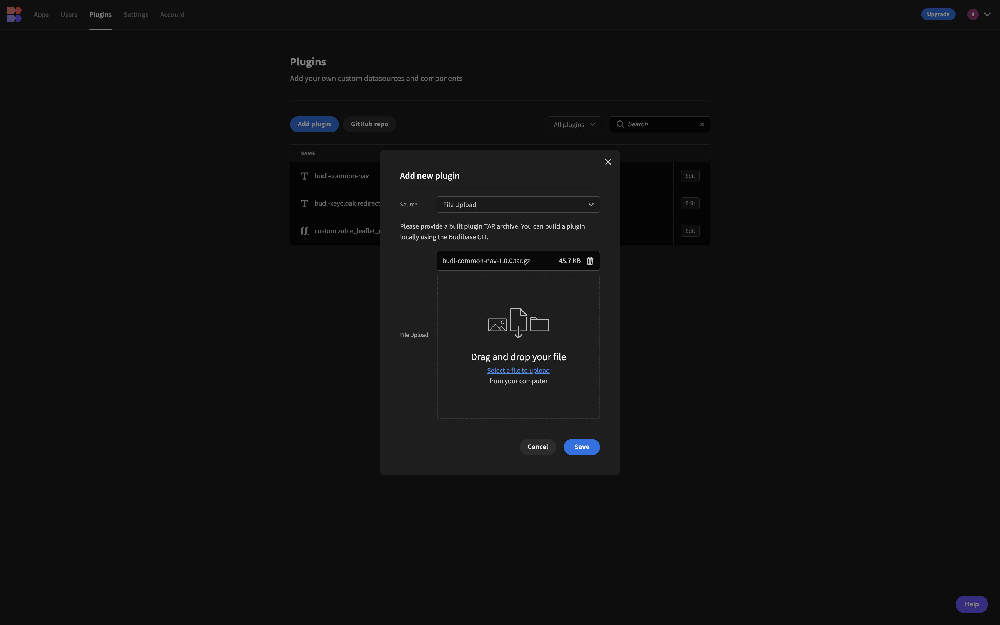
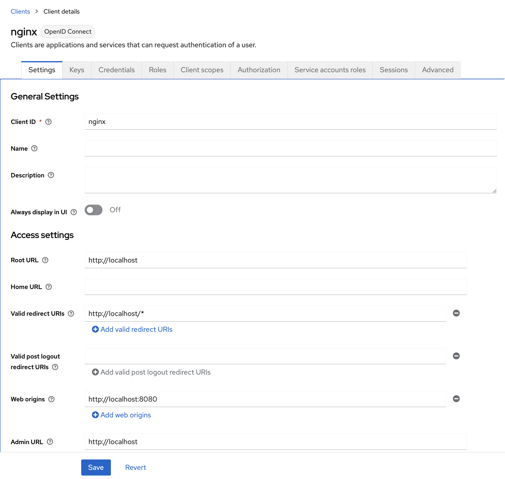
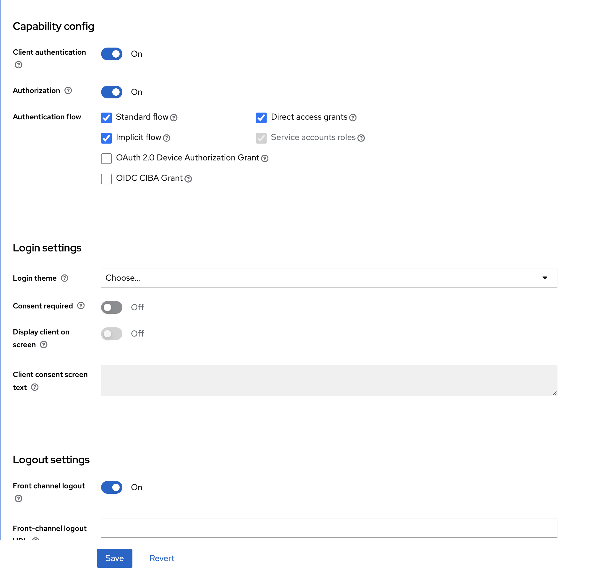
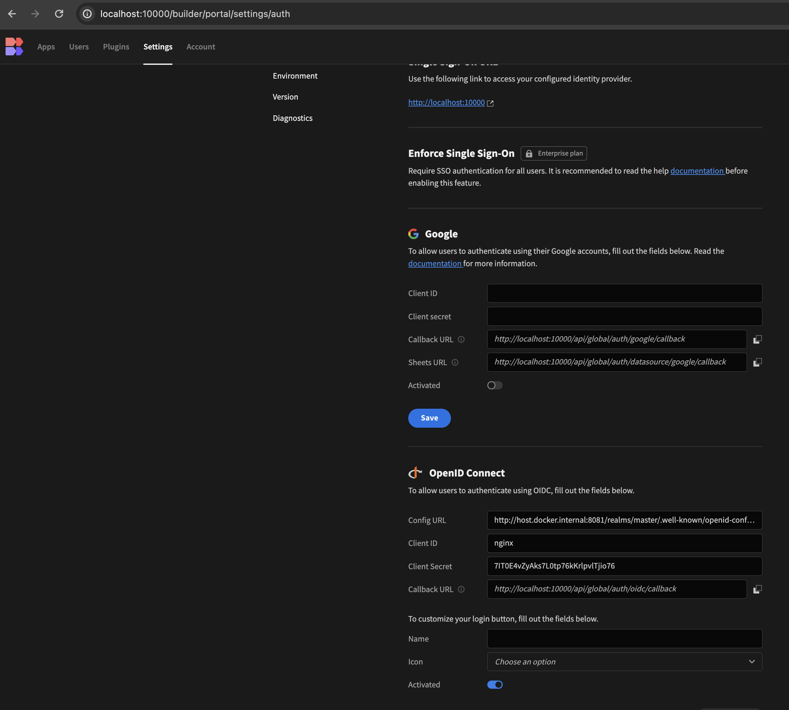
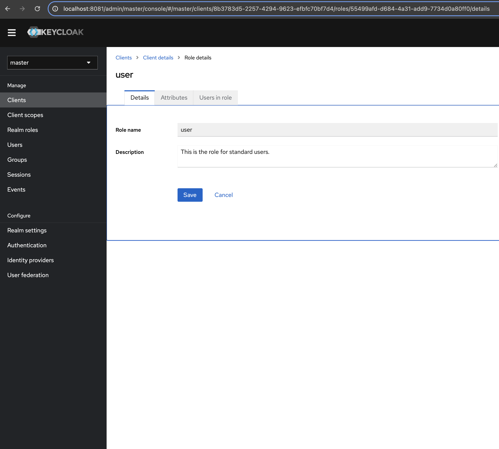
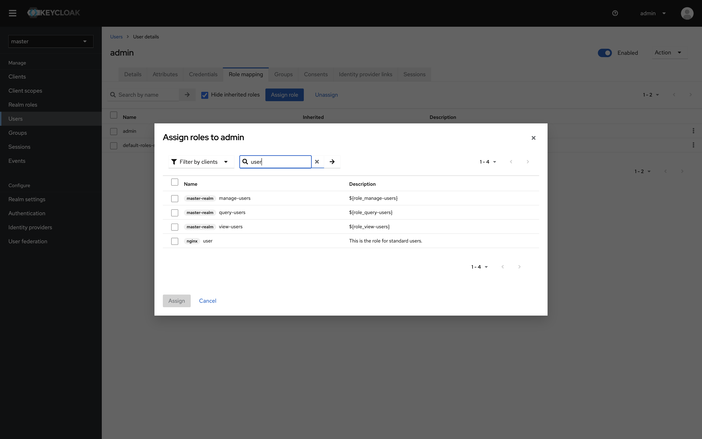
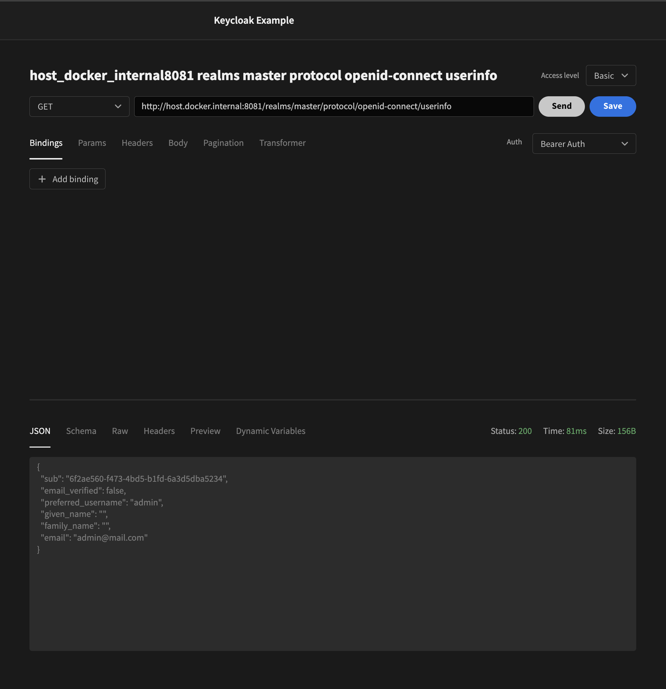
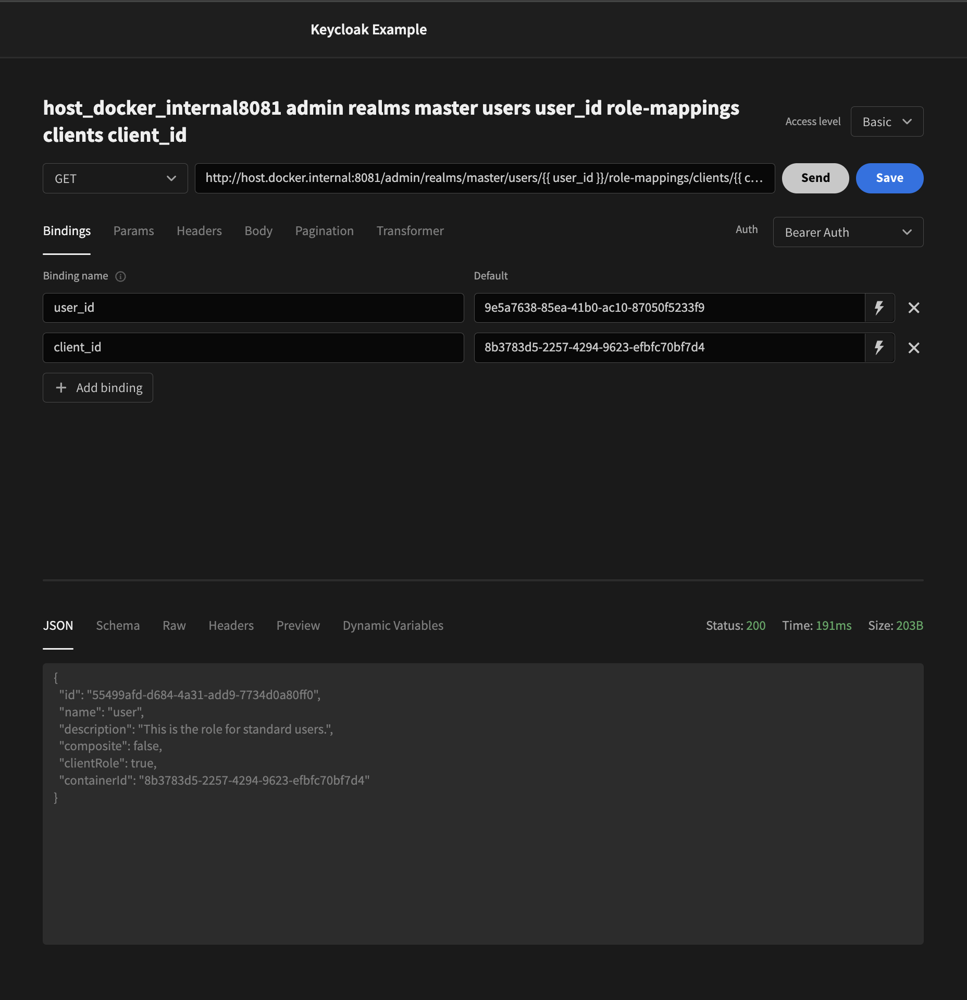
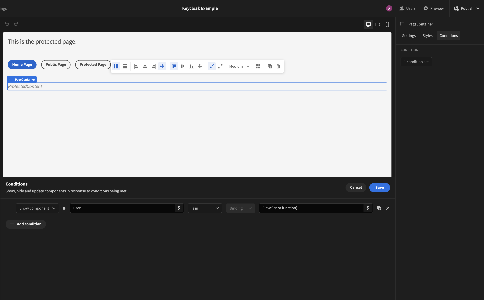
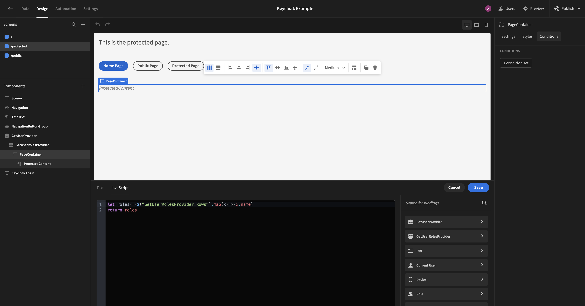

# Budibase

# **Prerequisites**

## Budibase CLI

You should ensure you have Node and Docker installed on your system. An example is shown below for Linux (Debian/Ubuntu). On MacOSX consider using [brew](https://changelog.com/posts/install-node-js-with-homebrew-on-os-x) and on Windows consider using [chocolatey](https://vocon-it.com/2019/11/19/install-npm-using-chocolatey-on-windows/).

```
# https://docs.budibase.com/docs/budibase-cli-setup
# These commands can be used to install the Budibase CLI on a debian/ubuntu distribution
sudo apt install docker.io
curl -sL https://deb.nodesource.com/setup_14.x | sudo bash -
npm install -g @budibase/cli
budi --version
```

### Install Budibase CLI with NPM

If you already have NodeJS version 18+ on your system you can install the Budibase CLI tool with NPM as shown below.

```bash
npm install -g @budibase/cli
```

## Budibase

<aside>
💡 Refer to [https://docs.budibase.com/docs/kubernetes-k8s](https://docs.budibase.com/docs/kubernetes-k8s)

</aside>

# Instructions

## Overview

1. Build the plugins
2. Import the plugins
3. Add users in Budibase
4. Create a Keycloak client
5. Configure Budibase to use OpenID Connect
6. Create client roles
7. Import the keycloak example project

## Build a plugin

```bash
# To build a new plugin run the following in the Budibase CLI
# Outputs build folder (dist)
budi plugins --build
```

## Import a plugin

1. Navigate to the Plugins tab
2. Click on Add plugin button
3. Select File Upload as the source
4. Upload the compressed file in the build folder
    
    
    

## Add a Budibase user

1. Navigate to the Users tab
2. Click on Add Users button
3. Fill the input box with email address

<aside>
💡 To authenticate using a Keycloak user, you must include the user in the list of Budibase users. Else, you will encounter a 502 Bad Gateway error.

</aside>

## Create a Keycloak client





## Configure Budibase to use OpenID Connect

### Important Notes

- Authentication is not set on the app level. In Budibase, users are shared across your whole Budibase installation. Users can sign into any app that they have access to. Self-registration is **not supported** by Budibase. Instead, users with the Admin role can use the user management page to invite, delete and create new users as well as change their Budibase application roles.
- To add users to your Budibase installation, you need to have administrative access.
- At a high level, a user can have access to the Portal as an Admin, or simply be a Member, i.e. an End User of authorised apps.
- Based on Budibase, only application Screens with Public Access level can be viewed within an embedded Budibase app.

### Budibase settings

| Fields | Remarks |
| --- | --- |
| Config URL | URL where Budibase can find the OpenID Provider Configuration Document |
| Client ID | Unique ID issued by Keycloak |
| Client Secret | Unique secret issued by Keycloak |
| Callback URL | Default is http://localhost:10000/api/global/auth/oidc/callback |
| Activated | Enable this option |



<aside>
💡 Since users can only be added using the Budibase user management panel, be sure to add the user email in Budibase before logging into Keycloak using valid credentials.

</aside>

<aside>
💡 All pages should be set to Public. You can integrate the Keycloak authentication scheme using the budi-redirect-keycloak plugin.

</aside>

## Create client role(s)

This example shows how to create a Keycloak client role, “user”, for standard users.

1. Navigate to the Clients tab
2. Select a client
3. Navigate to the Roles tab
4. Click on the Create Role button
5. Fill up the input boxes with the role name and description
    
    
    

## Assign role to user (role mapping)

1. Navigate to Users tab
2. Select a user
3. Navigate to Role mapping tab
4. Click on the Assign role button
5. Assign role to user
    
    
    

## Import Keycloak example project

1. Navigate to Apps tab
2. Click on Create new app
3. Select Import app
4. Upload the compressed file (budi-keycloak-example.tar.gz)

## Configure Keycloak example project

### REST endpoints

- Keycloak Admin REST API provides many endpoints to perform administrative tasks such as retrieving user information and related roles.
- Budibase provides us with the user’s access token, which can be used in REST queries. Using this token, we can use Keycloak REST endpoints to retrieve user information and related roles.

```html
Endpoint to retrieve user's information
http://{keycloak_domain}/realms/master/protocol/openid-connect/userinfo

Endpoint to retrieve user's roles
http://{keycloak_domain}/admin/realms/master/users/{user_id}/role-mappings/clients/{client_id}
```





## Default protected page

### Configure Keycloak Login plugin

| Parameters | Comments |
| --- | --- |
| ID | Find the Provider ID at /api/global/configs/public/oidc?tenantId=default |
| App Path | Path of published app |
| User ID | Bind the Budibase user to the User ID parameter |

### Configure Get User Data Provider (Budibase)

1. Set the Data parameter to the Get user REST endpoint.

### Configure Get User Roles Data Provider (Budibase)

1. Set the Data parameter to the Get user roles REST endpoint.
2. Bind the Budibase user to User ID in query bindings.
3. Bind the Keycloak Client ID to Client ID in query bindings.

### Configure Budibase Container

1. Add a condition to the Budibase container.
    
    
    
    <aside>
    💡 A parent container containing child components can be conditionally rendered based user roles.
    
    </aside>
    
2. Map the get user roles query response to a list roles.
    
    