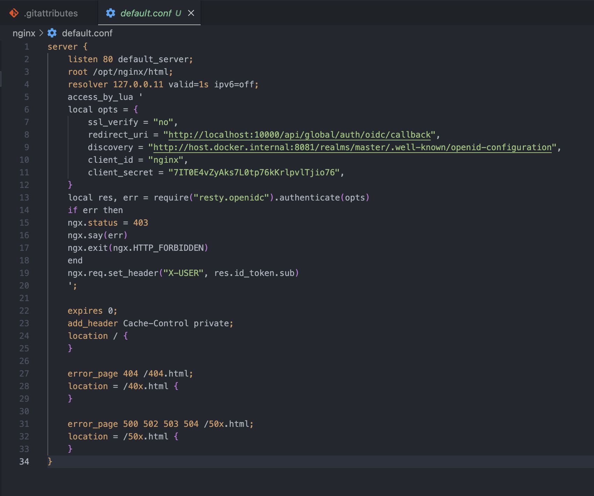
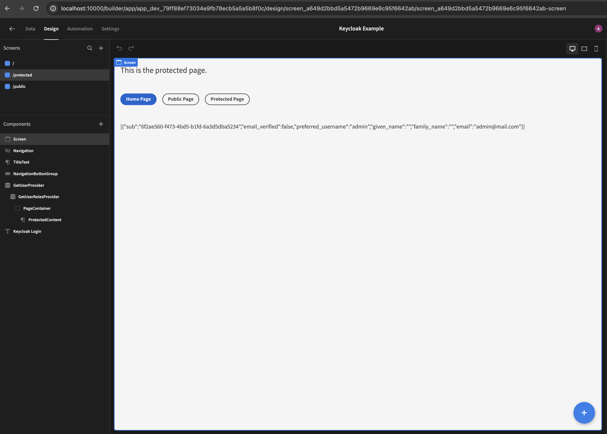

# Budibase

## Installation

<aside>
💡 Refer to [https://docs.budibase.com/docs/kubernetes-k8s](https://docs.budibase.com/docs/kubernetes-k8s)

</aside>

## Authentication

### Key takeaways

- Authentication is not set on the app level. In Budibase, users are shared across your whole Budibase installation. Users can sign into any app that they have access to. Self-registration is **not supported** by Budibase. Instead, users with the Admin role can use the user management page to invite, delete and create new users as well as change their Budibase application roles.
- To add users to your Budibase installation, you need to have administrative access.
- At a high level, a user can have access to the Portal as an Admin, or simply be a Member, i.e. an End User of authorised apps.
- Based on Budibase, only application Screens with Public Access level can be viewed within an embedded Budibase app.

## SSO (Single Sign-On)with Keycloak

### Keycloak client


### Nginx to act as a reverse proxy (optional)



### Budibase settings

| Fields | Remarks |
| --- | --- |
| Config URL | URL where Budibase can find the OpenID Provider Configuration Document |
| Client ID | Unique ID issued by Keycloak |
| Client Secret | Unique secret issued by Keycloak |
| Callback URL | Default is http://localhost:10000/api/global/auth/oidc/callback |
| Activated | Enable this option |


<aside>
💡 Since users can only be added using the Budibase user management panel, be sure to add the user email in Budibase before logging into Keycloak using valid credentials.

</aside>

<aside>
💡 All pages should be set to Public. You can integrate the Keycloak authentication scheme using the budi-redirect-keycloak plugin.

</aside>

## Access control with Keycloak

Given that the audience for different pages is different, we need to implement access control. Budibase manages refresh tokens and provide us with access tokens, which can be used in REST queries. We include this access token in the authorization header when we send requests to Keycloak REST endpoints.

Keycloak Admin REST API provides many endpoints to perform administrative tasks such as retrieving user information and related roles.

Budibase provides us with the user’s access token, which can be used in REST queries. Using this token, we can use Keycloak REST endpoints to retrieve user information and related roles.

### Client roles

We start by creating client roles and assigning them to users (role mapping). In the example below, we create a client role, user, for standard users.


<aside>
💡 The first REST endpoint we use to retrieve user’s information like user id is http://{keycloak_domain}/realms/master/protocol/openid-connect/userinfo.

</aside>

```html
Endpoint to retrieve user's information
http://{keycloak_domain}/realms/master/protocol/openid-connect/userinfo

Endpoint to retrieve user's roles
http://{keycloak_domain}/admin/realms/master/users/{user_id}/role-mappings/clients/{client_id}
```

### Budibase (protected) page overview



### Budibase REST queries


<aside>
💡 Add the first data provider that is responsible for providing the user’s information. This is required to get the user id. The sub-field in the response object is the user id.

</aside>


<aside>
💡 Add the second data provider that is responsible for providing user roles.

</aside>

### Achieving access control with conditional rendering


<aside>
💡 A parent container containing child components can be conditionally rendered based user roles.

</aside>